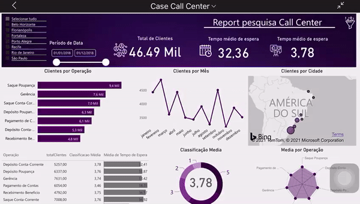

<H1> Bem Vindos </H1>

## Description
Curso Power BI, ministrado pelo professor Felipe Mafra. Curso muito rico onde foi aprendido tratar dados, manipulação de diversos tipos de arquivos, Web Scraping, linguagem M e DAX, conexões com diversos bancos de dados, relacionamentos, conceitos de BI como OLTP e OLAP, modelos Star e Snowflake, etc.

O video abaixo foi o Dashboard desenvolvido no desafio final do curso.(Caso queira consultar o arquivo PIBX está no repositório.)

  
 

 

